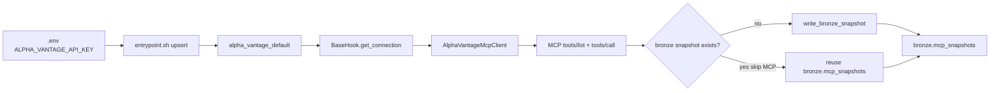
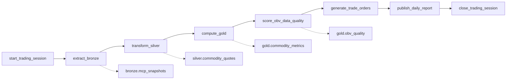

# Airflow Sample Project

Containerized **Apache Airflow 3.3.1** (Python 3.12) with PostgreSQL, Redis, and sample DAGs. Commodity prices come from the [Alpha Vantage MCP server](https://mcp.alphavantage.co/#connection-examples).

## Quick Start

**Prerequisites:** Docker Compose, a free [Alpha Vantage API key](https://www.alphavantage.co/support/#api-key), local Python **3.12+** for tests.

```bash
cp .env.example .env
# Set ALPHA_VANTAGE_API_KEY — never commit .env
docker compose up -d --build
```

UI: [http://localhost:8080](http://localhost:8080) (`admin` / `admin`).

```bash
docker compose down
```

## Secrets (Connection, not `.env` at runtime)

`.env` is **boot seed only**. `entrypoint.sh` upserts Airflow Connection `alpha_vantage_default` (SQL delete-then-insert under a Postgres advisory lock):

| Field | Source |
|-------|--------|
| conn-password | `ALPHA_VANTAGE_API_KEY` |
| extra `transport` | `ALPHA_VANTAGE_TRANSPORT` (default `http`) |
| extra `mcp_url` | compose default `https://mcp.alphavantage.co:18080/mcp` |
| extra `mcp_sse_url` | compose default `https://mcp.alphavantage.co:18080/sse` |

Tasks read the key and extras with `BaseHook.get_connection('alpha_vantage_default')` (metadata DB fallback outside a task; env fallback for unit tests). Compose pins `AIRFLOW__CORE__FERNET_KEY` so every service can decrypt the password.

Production: use an Airflow secrets backend. Do not rely on `.env`. The key is never committed; task logs redact `apikey=` query values.

## MCP transport

| `ALPHA_VANTAGE_TRANSPORT` | Path |
|---------------------------|------|
| `http` (default) | Streamable HTTP |
| `sse` | Legacy HTTP+SSE |
| `stdio` | Local `uvx marketdata-mcp-server` (needs `uvx`) |
| `rest` | Legacy `www.alphavantage.co/query` (not MCP) |

### Docker Desktop vs host-network forwarder

Compose includes `mcp-https-forwarder` (`host:18080` → `mcp.alphavantage.co:443`) and `extra_hosts` so Airflow containers keep the TLS name `mcp.alphavantage.co`. Use this when the **compose bridge cannot SNAT** to the public internet (nested VMs, some CI). That is separate from `net.bridge.bridge-nf-call-iptables=0`, which only affects container-to-container traffic.

**Docker Desktop (Mac/Windows)** does not support `network_mode: host`. Skip the forwarder and talk to Cloudflare directly:

```bash
# in .env
ALPHA_VANTAGE_MCP_URL=https://mcp.alphavantage.co/mcp
ALPHA_VANTAGE_MCP_SSE_URL=https://mcp.alphavantage.co/sse
```

## Sample DAGs

1. Enable and trigger **`alpha_vantage_mcp_read`** (manual): `list_mcp_tools` (`tools/list`) then `read_wti_monthly` (`tools/call` WTI monthly).
2. Daily **`commodity_trading_dag`** — medallion pipeline for gold, WTI, wheat, copper, natural gas.

## Workflow schema

**Medallion** here is a warehouse pattern (not a commodity and not an Airflow feature): raw **Bronze**, cleaned **Silver**, business-ready **Gold**. This sample maps that onto `commodity_trading_dag` tasks and Postgres schemas of the same names.

| Layer | Meaning | This DAG |
|-------|---------|----------|
| Bronze | Immutable raw extract | `extract_bronze` → `bronze.mcp_snapshots` |
| Silver | Validated / typed tables | `transform_silver` → `silver.commodity_quotes` |
| Gold | Metrics a BI tool can read | `compute_gold` → `gold.commodity_metrics`; `score_obv_data_quality` → `gold.obv_quality` |

How Connection `alpha_vantage_default` feeds bronze, then the `commodity_trading_dag` task graph (names match `commodity_dag.py`).



`extract_bronze` opens `AlphaVantageMcpClient` only when a symbol still needs a fetch (`ALPHA_VANTAGE_TRANSPORT=rest` uses `_alpha_vantage_rest_get` instead of MCP).



`score_obv_data_quality` is a dedicated task after `compute_gold` in this DAG. Silver also writes `silver.commodity_price_series`; gold SQL is `compute_gold_metrics_sql`.

## Medallion (`commodity_trading_dag`)

Postgres schemas `bronze` / `silver` / `gold` (same instance as Airflow metadata) plus JSON under `data/medallion/`.

| Task | Layer | What it writes |
|------|-------|----------------|
| `extract_bronze` | Bronze | Immutable MCP/REST payload (`bronze.mcp_snapshots` + `data/medallion/bronze/<ds>/<symbol>.json`). **Skips MCP** if that snapshot already exists. |
| `transform_silver` | Silver | Schema / nulls / non-positive checks → `silver.commodity_quotes`, `silver.commodity_price_series` |
| `compute_gold` | Gold | **SQL** metrics in `gold.commodity_metrics` (latest/min/max/avg, count, period return) plus weighted signals |
| `score_obv_data_quality` | Gold | Synthetic-volume `compute_obv_signal` vs linear price trend → `gold.obv_quality` |
| `generate_trade_orders` | — | Notional BUY/SELL orders |
| `publish_daily_report` | — | Summary including gold metrics and OBV quality scores |

BI can read `gold.commodity_metrics` and `gold.obv_quality`. Unit tests use SQLite + temp JSON.

On retry you should see `Reusing bronze snapshot for GOLD ... (skip MCP)` instead of another live fetch.

## Signals

Commodity MCP series have no volume; `compute_obv_signal` uses `|price change|` as a proxy. `score_obv_data_quality` scores that proxy against the actual price trend line.

| Function | Default weight |
|----------|----------------|
| `compute_momentum_signal` | 0.15 |
| `compute_moving_average_signal` | 0.25 |
| `compute_rsi_signal` | 0.25 |
| `compute_macd_signal` | 0.25 |
| `compute_obv_signal` | 0.10 |

Weighted score: **BUY** ≥ `0.25`, **SELL** ≤ `-0.25`, else **HOLD**.

| Symbol | MCP tool | Interval |
|--------|----------|----------|
| `GOLD` | `GOLD_SILVER_HISTORY` (spot fallback) | monthly default (daily optional) |
| `CRUDE_OIL` | `WTI` | monthly default (daily optional) |
| `NATURAL_GAS` | `NATURAL_GAS` | monthly default (daily optional) |
| `COPPER` | `COPPER` | monthly only |
| `WHEAT` | `WHEAT` | monthly only |

Free-tier ~5 req/min; pause defaults to 15s (`ALPHA_VANTAGE_REQUEST_PAUSE_SECONDS`). `demo` only covers a subset of endpoints.

## Project structure

```
.
├── Dockerfile
├── docker-compose.yml      # api-server, scheduler, dag-processor, postgres, redis, MCP forwarder
├── entrypoint.sh           # migrate, admin user, Connection seed, warehouse DDL
├── requirements.txt
├── .env.example
├── dags/
│   ├── alpha_vantage_mcp.py           # MCP client + Connection helpers
│   ├── medallion.py                   # bronze/silver/gold I/O
│   ├── alpha_vantage_mcp_read_dag.py
│   ├── commodity_dag.py
│   └── sample_dag.py
└── tests/                  # mocked MCP; no live key
```

## Environment variables

See `docker-compose.yml` for Airflow. Commodity / MCP:

- `ALPHA_VANTAGE_API_KEY` — seeds Connection `alpha_vantage_default` (do not commit `.env`)
- `ALPHA_VANTAGE_TRANSPORT` — `http` / `sse` / `stdio` / `rest`
- `ALPHA_VANTAGE_MCP_URL` / `ALPHA_VANTAGE_MCP_SSE_URL` — forwarder defaults `:18080`; Desktop: URLs without the port
- `MEDALLION_DATA_DIR` — default `/app/data/medallion`
- `ALPHA_VANTAGE_INTERVAL` — `monthly` (default) or `daily`
- `ALPHA_VANTAGE_REQUEST_PAUSE_SECONDS` — default `15`
- `SIGNAL_WEIGHT_*` / `SIGNAL_BUY_THRESHOLD` / `SIGNAL_SELL_THRESHOLD`

## Tests

From `default/`:

```bash
PYTHONPATH=dags python -m unittest discover -s tests -v
```

Mocked MCP session + temp SQLite warehouse. No live key required.

## Services & troubleshooting

- UI `8080` · Postgres `5432` · Redis `6379` · LocalExecutor · Simple Auth Manager (`admin`/`admin`)
- Postgres holds Airflow metadata **and** `bronze` / `silver` / `gold`

If a run stays `queued`: rebuild, and confirm `AIRFLOW__CORE__EXECUTION_API_SERVER_URL=http://airflow-api-server:8080/execution/` (service name, not `localhost`). Then `docker compose logs airflow-scheduler --tail=200`.
